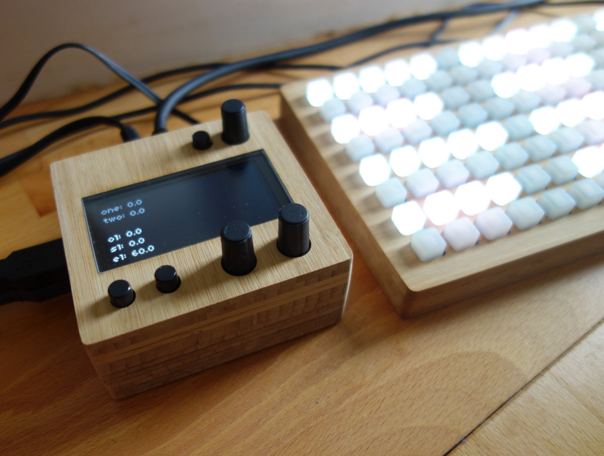

Layered enclosure designs for projects by or inspired by [monome](https://monome.org)

For more information see forum discussions [here](https://llllllll.co/)

These enclosures are intended for use with laser-cut 3mm bamboo sheets.

### Please note

These are not cut-and-snap-together designs! For a good quality finish, the bamboo layers need to be glued together using clamps, then sanded to remove excess glue and lasercutter burns. Some craft experience and lots of patience is recommended.

## License

 This work is licensed under a <a rel="license" href="http://creativecommons.org/licenses/by-nc-sa/3.0/">Creative Commons Attribution-NonCommercial-ShareAlike 3.0 Unported License</a>.
That means that you're free to use the project with attribution, except for commercial purposes, and you should share any remixes or modifications using the same license.